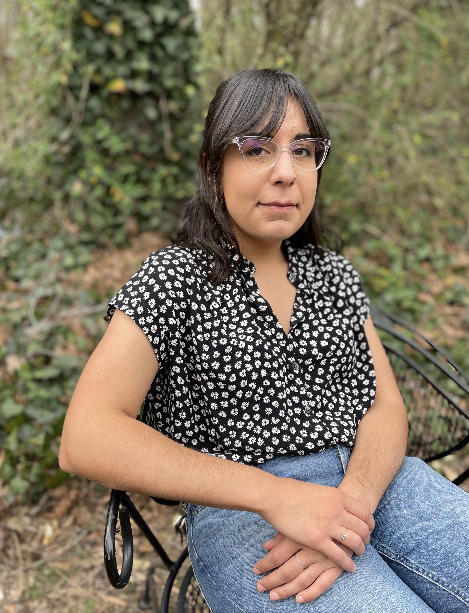

<link rel="stylesheet" href="styles.css" type="text/css">

### **I am a Doctoral Candidate in [Genetics & Molecular Biology](http://gmb.unc.edu/) at The University of North Carolina at Chapel Hill.**

#### My research interests center around understanding and investigating the contributions of genetic and environmental factors to complex phenotypes and disease processes. I have a particular fondness for the immune system.

In spring 2016, I joined the lab of [Dr. Samir Kelada](http://keladalab.web.unc.edu/). For my dissertation research, I use a variety of experimental and computational approaches to identify mechanisms that contribute to ozone-induced respiratory toxicity. One aim of my work is to better understand the inflammatory, transcriptional, and epigenomic dynamics of ozone-exposed airway macrophages. Additionally, I work with a genetically diverse population of mice known as the [Collaborative Cross](http://csbio.unc.edu/CCstatus/index.py) to identify genetic loci that modify responses to ozone exposure.

I earned an S.B. in Course 7 - Biology from the Massachusetts Institute of Technology in spring 2015. As an undergraduate, I worked in the lab of [Dr. Darrell Irvine](https://irvine-lab.mit.edu/) and was mentored by [Dr. Greg Szeto](http://gregoryszeto.com/). I studied the aryl hydrocarbon receptor and its roles in innate and adaptive immunity. My work also involved the development and utilization of biocompatible drug delivery formulations for research and cancer immunotherapy.